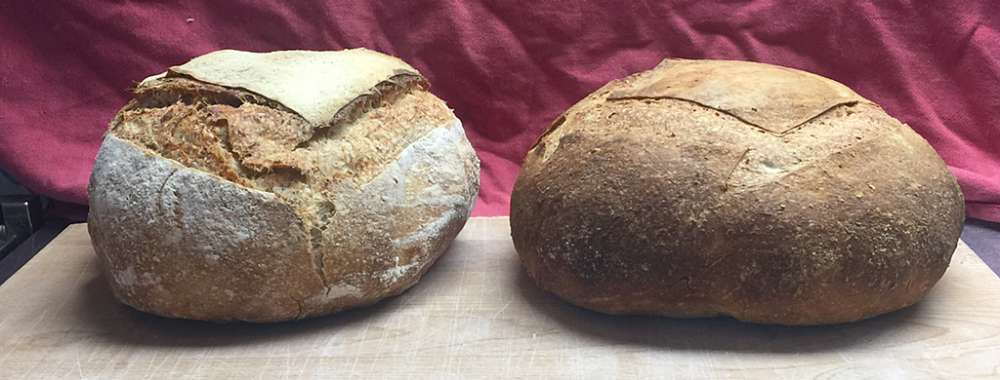
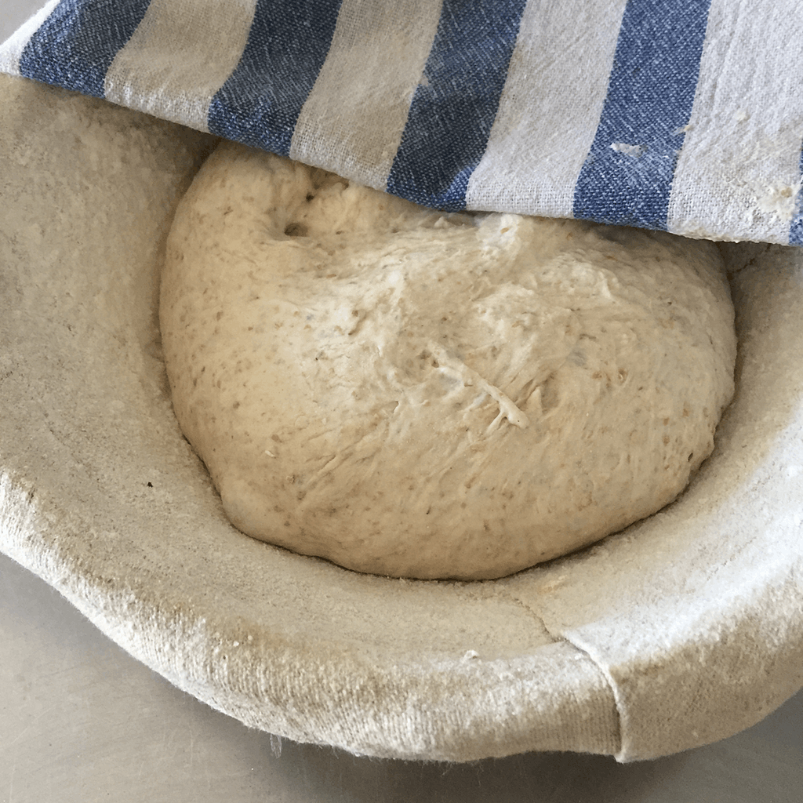

{.center} 

Want to learn more about bread? And how to bake with traditional leavens? And visit a working watermill? 

I will be part of [a two-day workshop at Coleg Trefeca](https://blackmountainscollege.uk/project/the-future-of-bread/) in the gorgeous Brecon Beacons in Wales on 23-24 June.

===

I'll be working alongside Colin Tudge, one of the most thoughtful writers on farming and agriculture, and Ruth West, who organised the first Rise of Real Bread conference in Oxford and is a force in farmers markets and agroecology.

We'll be talking about bread itself and as an example of how most food is produced today, with narrowly conceived financial profit as the goal and little regard for the health of people or the planet. Bread offers a chance to look at how we arrived at the wonder of a 36p supermarket loaf and what it would take to put that right.

During the course we will explore the history of bread and milling, modern bread production and who is leading the drive for change, and how a new localised bread culture could change the face of agriculture. 

{.center} 

On the second day, [at Talgarth Mill](https://talgarthmill.com), we will see wheat turned into flour and together transform the flour into tasty sourdough loaves. 

You will leave with a deeper understanding of the part bread plays in our culture and agriculture, a booklet of instructions and recipes, and your own sourdough starter.

Details of the course are on the [Coleg Trefeca website](https://blackmountainscollege.uk/project/the-future-of-bread/), which has a handy-dandy link to book the course.

!!! Syndicated from [Fornacalia](https://www.fornacalia.com/2019/the-future-of-bread-a-course-in-wales/)

