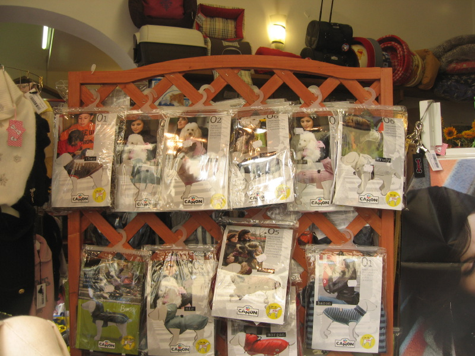
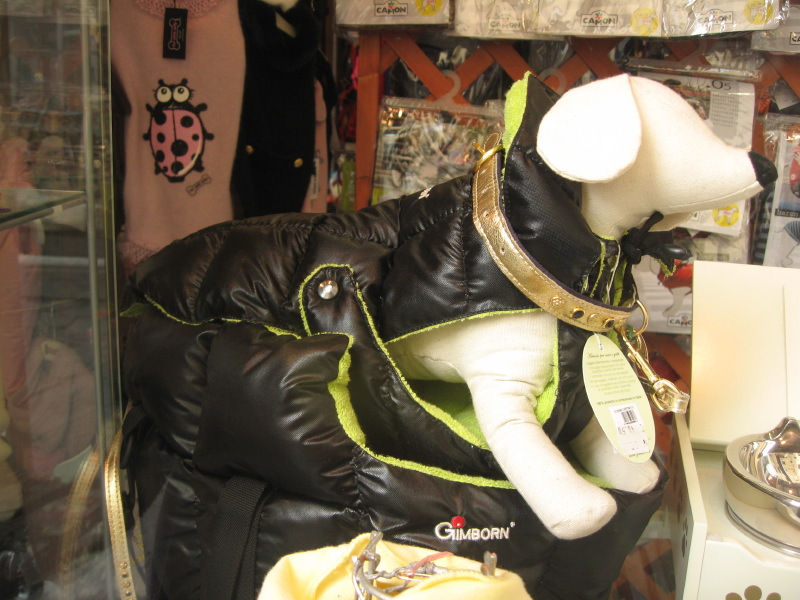

We spent a lovely weekend in Florence a few days ago, including some quality time with friends we don’t often see. But there’s nothing I can say about Florence that hasn’t been said better elsewhere, so I won’t even try. Instead, I’ll share this.

{.center}

In case you can't quite make it out, it is a pet shop window. With a rack of coats. For dogs. There's a mannequin dog too.

{.center}

Further proof that Italy is not a land of unadulterated good taste and that some people have more money than brains. As for the poor dogs, my heart goes out to them. And does my dog’s.
