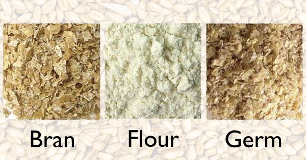

{.center}

That kernel of wheat isn’t actually a seed or a berry, at least not to a botanist. I have no intention of getting into the whole pointless is-it-a-fruit-or-a-vegetable debate, so lets just agree that no matter what you call it, the wheat thing is made up of three major parts: bran, endosperm and germ. In this episode, a little about each of those parts and what they do for wheat.

<a href="https://www.eatthispodcast.com/our-daily-bread-12/" rel=canonical>Listen to The inside story at Eat This Podcast.</a>