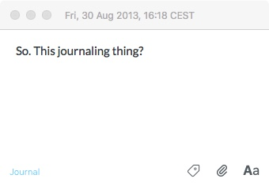
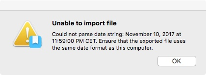

I’ve been a happy user of [exist.io](https://exist.io) since November 2017, and I’m not unhappy with it today. Since I got my Apple Watch, though, it just does not seem have offered any value for money, because the watch gathers and shares all the data that used to flow through exist, and the insights exist was offering me just didn’t seem that insightful any more. The catch was in my daily diary.

===

I had been using exist’s mood feature as a way to jot down notes about the day, which occasionally were indeed related to my mood.[^1] That could get a tad annoying, because exist lacks a search feature for mood notes and showed no interest in building one, which is fine by me. I was probably an edge case, and I got round it by copying each mood note to a diary text file. Those notes I do find handy.

I had also been a happy user of Day One since 30 August 2013, although I refused to move to a subscription at the same time as I started using exist. 

{.center}

Day One has the distinct advantage over exist that it is actually designed for diarising, rather then me finding a way to use it as a diary. And it boasts more import options than you can shake a stick at. Prudent to the last, I downloaded all my data from exist in all the formats they offer and a trial copy of Day One in the fond hope that a couple of clicks would consolidate all my diary entries in one place.

It was not to be.

I will say that Day One imported entries from Day One Classic magnificently. Flawless. Unfortunately, that raised my hopes even higher.

## Hopes dashed

Importing any data not expressly exported by Day One proved almost impossible. Furthermore, there’s only one error message, as far as I can tell, and it is singularly unhelpful.

{.center}

You can fiddle with your date and time settings to your heart’s content, it will make no difference. I downloaded all of the helpful examples Day One provides of its different data formats, and after slavishly duplicating the plain text formats in formed by Day One’s support squad that the example itself was poorly formatted. OK.

I sent him my little text file. He imported it successfully, which was equal parts annoying and frustrating. Finally, he sent me a screenshot of his date and time settings and suggested I pretend my computer was in Colorado, with a restart thrown in for good measure.

And blow me if that didn’t work.

## Hope rekindled

With a lot of help from BBEdit (and not enough from grep) I massaged my data into a form exactly mimicking the sample that had worked. Finally I was ready to try the big import. Same error, I swear, but this time I at least knew that the format of the data was not the problem. So it had to be the amount of data, a whole 462 kb. Or maybe the number of entries, 1032. I cut the file into smaller pieces, and that, eventually seemed to satisfy the Day One importer. It took five separate little files, but here I am, able to see the full, glorious history of my diarising back to August 2013.

And you know what? I like being able to do that.

[^1]: I should note that I am a very poor subject for mood notes, as I invariably am a 4, rarely a 5 and even more rarely a 3. So giving me a finer-grained scale just added to the pressure. What might the difference between a 7 and and 8 be? Between an 8 and a 9?