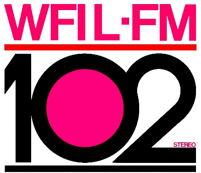

Alex Blumberg interviewed Pierre Sutton and his daughter Keisha on a recent episode of his series <a class="u-in-reply-to" href="https://www.gimletmedia.com/without-fail/how-a-revolution-turned-into-americas-number-one-radio-station#episode-player" >Without Fail</a >. Sutton's giant achievement was to create black-owned "race" music radio stations, and listening to the episode triggered a memory from long, long ago.

===

{.left} To understand why, you need to know that aside from creating black-owned radio, Pierre Sutton also brought FM transmission to non-classical music. Most radio was AM and that, as Alex explained for the kids, "was scratchy and tinny, and only in mono. FM was rich and full, and in stereo". But most FM transmitters were not great in cities. Pierre Sutton met [a man who had invented an antenna that vastly improved FM transmitters](http://mmone.org/t-mitchell-hastings/), and changed music radio forever. [^1]

[^1]: listen to the episode to understand just how much.

This was some time around the late 1960s early 1970s. And in the summer of 1970 I was on my first visit to the United States, land of wonder, as a counsellor with Camp America. After a summer in Vermont, we had two weeks and 100 dollars to explore the country, and with some of my new-found friends I headed off to Florida. On the way, we stopped in a friend's house in Philadelphia. I cannot for the life of me remember whose house it was, but I was given the spare room in the basement.

There was a waterbed! And a terrific sound system, or as we called them then, a stereo, with an AM-FM receiver. The sound quality completely astounded me. From a radio?!?

Anyway, there I was, late on a summer's evening, lolling on the waterbed and listening to cool tunes. I have a strong feeling it was [Herbie Mann's Battle Hymn of the Republic](https://www.youtube.com/watch?v=DJT_acVUjV4); that would certainly fit. And suddenly I hear this loud whisper.

"Pssst!"

And again -- "Pssst" -- from the other side of the room. And I almost freak out. And then a lugubrious voice says something like "Pssst ... WFIL-FM Philadelphia".

And I relax, go back to lolling, and marvel at the power of (FM) radio. [^2]

[^2]: WFIL-FM logo by HGN2001 [<a href="https://creativecommons.org/licenses/by-sa/3.0">CC BY-SA 3.0</a>], <a href="https://commons.wikimedia.org/wiki/File:WFILFMsmall_copy.jpg">via Wikimedia Commons</a>. I have no idea whether it is contemporary, as I never saw it at the time.
