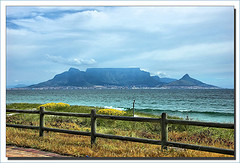

_New readers begin here:_ A while ago I succumbed to [the lure of an internet list](https://jeremycherfas.net/blog/lazy-blogging-just-one-of-the-things-ive-done/). Then I decided to expand on the Things I’d Done.

[{.left}](https://flickr.com/photos/ifijay/2992453312/) What constitutes a [mountain](https://en.wikipedia.org/wiki/Mountain)? “There is no universally accepted standard definition for the height of a mountain or a hill although a mountain usually has an identifiable summit.” In which case, yes, several times, but never with ropes and carabiners and all that sort of thing. And because I’ve never been a “mountain climber” as opposed to someone who occasionally climbs mountains, it is quite hard to list them. Table Mountain, for starters. And a few [Munros](https://en.wikipedia.org/wiki/Munro). Etna, on my second ever trip to Italy, setting off at four in the morning and warming ourselves over Hadean fumaroles. Others too.
