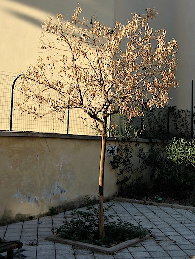

More than a year ago now [I wrote](https://jeremycherfas.net/blog/scenes-from-roman-life-12-who-could-hate-a-tree/) “I’m going to have to see that tree every morning. And that makes me very angry”. But the truth was, I became inured to the deliberate ring-barking that had sentenced the tree, an orange outside a nearby church, to death. In fact, on the few occasions when I thought about the tree, I thought about how resilient it was, surviving despite being ring barked. Until last week, when I noticed it was dead.

{.center}

You can still see the girdling in the shadows. And you can see the fruits it had tried to produce, shrivelled on the branches. I guess it was the heat what done for it; its neighbour remains lush and green.

When I stopped to take a picture of it one of the East European vagrants who hang about there lumbered up, grinned toothlessly and asked -- palm outstretched -- if I wanted to take his picture. I said no thanks, I don’t have the time.

I doubt he felt my resurgent anger.
