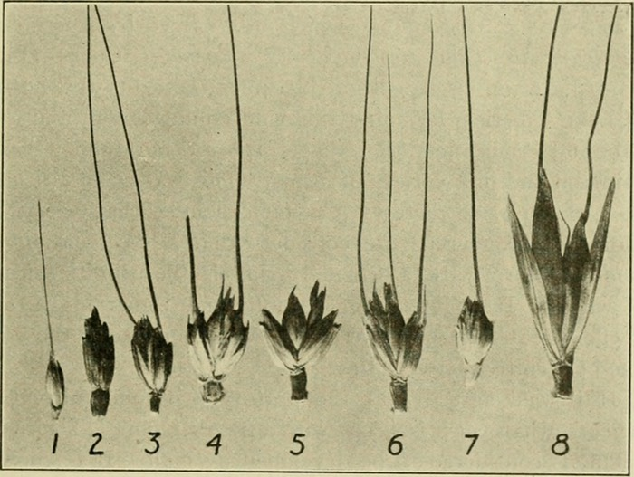
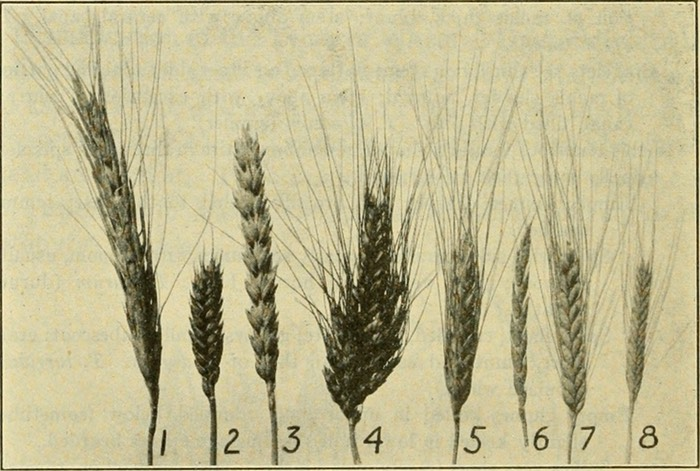

A friend recently asked me what to call the ancient wheat known as *farro*. The word derives from [the Latin _far_](https://en.wiktionary.org/wiki/far#Latin) and she knew, as she explained, that “it is not spelt — as all of the classicists want to translate it.” And indeed it isn’t. Alas, the only correct answer to this fascinating question can only be, “It depends”.

===

## Start with biology

Common names are a trap for the unwary, but so too are scientific names, because the names attached to biological entities are fluid, rather than fixed, as are the biological entities themselves. Nothing illustrates this better than the wheats. As perhaps the most rigorous investigation of the problem put it:

> Systematics and the nomenclature of cultivated and wild wheats is a constant and lasting problem.[^1]

That is one reason the answer to “What is _farro_?” will forever be “It depends”.

Biosystematics — one aspect of scientific names — is mostly interested in whether two plants can cross. If they do so very easily, they may well be different varieties of the same species (_Triticum monoccocum_). If they can be persuaded to cross in the laboratory, or do so very occasionally in nature, they might be different species (_T. monococcum_ and _T. dicoccon_) of the same genus (_Triticum_). But even plants placed by taxonomists in different genera can, under the right circumstances, cross (_T. dicoccon_ and _Aegilops_ spp.).

The people who grow and depend on them generally use “wheat” in whatever language to refer to grain harvested from any one of a number of populations of what a scientist would probably call _Triticum_. They tend not to use “wheat” for plants in a different genus. And they may not use “wheat” for all species of _Triticum_ that they grow. That’s where we start to get into trouble with _farro_.

To take a step back, in the broad group of wheats there are two distinct kinds based on one particular physical characteristic. The seed of undomesticated wheats is generally tightly enclosed in a protective structure generally called a hull. However, as we shall see, some domestic wheats are also hulled. The tight hull is controlled by a gene called _Q_, the hulled version of which is dominant. What this means in practice is that when you thresh the ears, you end up with spikelets, the individual bits of the ear of wheat. It takes quite a lot of pounding to remove the tough, protective hull and release the edible grain within.

At some point in the history of wheats, *Q* was replaced by *q*, the recessive allele.[^2] This made the seeds free-threshing; you just need to beat them about a bit with a flail or similar to free the grain from the loosely attached hull. Not surprisingly, early farmers quickly selected free-threshing mutants. As a result, very few cultivated wheats are hulled. That brings us to _farro_.

[{.center}](spikelets.jpg)

They are 1. einkorn T. monococcum 2. spelt T. spelta 3. emmer T. dicoccum 4. common bread wheat T. aestivum 5. club wheat T. compactum 6. durum wheat T. durum 7. Poulard wheat T. turgidum 8. Polish wheat T. polonicum
 

## Continue with anthropology

_Farro_ is an ethnographic or anthropological concept with deep roots in the Italian peninsula. The word is used to denote three cultivated species of hulled wheat: _T.monococcum, T. dicoccon_ and _T. spelta._ **But** … not all things called _farro_ are hulled wheats, and not all hulled wheats are _farro_.

In Italy, until the recent revival that brought _farro_ back to public attention, the species were almost always grown as a mixture, sometimes two species, sometimes all three. The farmers knew they were growing a mixture, and all the benefits of doing that, and they called the mixture _farro_. Crucially, as Szabo and Hammer (1996) point out: “It is worth noting the apparent uniqueness of this collective term farro, with no equivalent found by us in other European Anglo-Saxon, Latin, Slavonic and Finno-Ugric languages.” 

As for common names, for many people *T. monococcum* is called einkorn, *T. dicoccon* is called emmer and *T. spelta* is called spelt. And each of them is a component of true farro. But the marketing bandwagon rolls on, as a result of which we have farro piccolo, farro medio and farro grande (_aka_ spelta or faricello). As far as I know, no Italian grower of farro in the past ever separated them out in that way.

[{.center}](spikes.jpg)

Alas, the order is different. 1. Polish wheat 2. club wheat 3. common bread wheat 4. Poulard wheat 5. durum wheat 6. spelt 7. emmer 8. einkorn

 

## Back to biology

Genetically, there are obvious differences and more subtle ones. Most obviously, einkorn (hulled or free-threshing) is diploid, it has two sets of chromosomes. Emmer is tetraploid, with four sets of chromosomes. (Not a few taxonomists lump all the tetraploid wheats, including durum wheat and the various emmers, together as _T. turgidum_, but that rather ignores the important characteristic of whether they are hulled). Spelt is hexaploid, with six sets of chromosomes, just like bread wheat. 

Does any of this matter? Probably not in the overall scheme of things. Confusion will continue to bedevil anyone who wants to talk with any familiarity about the hulled wheats, singly or as a mixture. Flours of the individual species will have different properties, of course, but for most uses, you won’t be able to tell. If you are not using a mixture of hulled wheat species, I suggest you stick to the common names einkorn, emmer and spelt.

## How about some archaeology?

An important part of the puzzle is that much of the wheat being consumed in ancient Rome, which is what the classicists tend to concern themselves with, was not grown in Italy. A lot was coming from Egypt, so it seems reasonable to ask what they were growing there to export to Rome.

For a very long time, the main wheat of Egypt was hulled emmer. It resisted replacement long after free-threshing wheats had appeared elsewhere in the Near East, but any reservations the Egyptians may have had about free-threshing wheats were swept aside after the invasion by Alexander the Great in 332 BCE. The Ptolemaic rulers introduced free-threshing durum wheat, and that displaced hulled emmer very quickly, within 150 years. According to Dorothy Crawford, “[t]he only cause for surprise is the silence of the sources. The change is well-documented, but no comment on it has survived anywhere in the papyri or the agricultural writers”.[^3]

The real surprise is that the Egyptians did not grow bread wheat. *T. aestivum* had become the dominant cereal in Iraq and northern Syria by the 2nd millennium BCE. Even in southern Russia, it was dominant by 500 BCE. But remains of bread wheat are very scarce in Israel (ruled by Egypt in Ptolemaic times) and even more so in Egypt proper. The mystery deepens with the discovery in 1999 of some huge storage jars in what is believed to be an Egyptian administrative centre at Tel Kedesh in the north of Israel. A careful examination of the residue left in the jars indicates that they contained bread wheat. So what is it doing there?

The archaeologists who identified the bread wheat think it may represent Ptolemaic agricultural experimentation. Ptolemy II, who reigned from 284–247 BCE, was responsible for the introduction of many new crops and varieties, including pistachios, garlic, chickpeas, walnuts and figs. “The most commonly cited category, however, is wheat, which appears in various new guises, including a strain that required only a 3-month season from sowing to reaping, and various geographically-specified types, including “Persian wheat”, “wheat of Kalymnos”, and “Syrian wheat”.[^4]

Andrea Berlin and her colleagues make a convincing case that the wheat at Tel Kedesh, bread wheat, was the Ptolemaic Syrian wheat. The question then is why Egyptian farmers failed to adopt it, unlike their counterparts in Iraq, northern Syria and southern Russia? Possibly, they argue, because Egypt was a much more advanced civilisation, with a highly developed economy in which wheat and bread were important forms of payment. Grain, as bread, delivered 70–75% of the calories consumed by an Egyptian worker. Durum wheat would make a low, dense, chewy bread. Syrian wheat, that is bread wheat, would have resulted in a lighter, airier loaf that, perhaps, just was not satisfying enough for the Egyptians.

In consequence we can say that any wheat arriving in Rome from Egypt would have been mostly emmer before about 150 BCE and mostly durum after that.

## Where did the spelt come from?

That leaves only the confused classicists and their spelt. Mary Anne Murray, one of the great experts at identifying archaeological plant remains, says this:

> Contrary to popular belief, the Egyptians did not grow spelt wheat (_Triticum spelta_). Reference to this is found throughout the literature and may stem from the use of the German term _Spelzen_ or _Splezweizen_ to refer to hulled wheats as a whole (Hillman 1984b: 146; Nesbitt and Samuel 1996: 77).[^5]

That’s good enough for me. Will they now please stop?

I realise there’s still no clear answer to the original question, and I regard that as a good thing. We are in the realm of anthropology and ethnography, where meaning depends on customs and history, and facts can be manipulated and recast, but not invented from whole cloth. Farro, for all the difficulties of the word, represents a genuine tradition that finds itself interrogated under a modern spotlight, and unlike fake, invented traditions, it has no simple secrets to divulge.

!!! I am extremely grateful to Mark Nesbitt for pointing me at some important archaeological research that I would never have found on my own. Any errors are my own alone.

!!! For the record, Szabo and Hammer identify eight different species of Triticum that could reasonably be included in _farro_: *T. boeoticum, T. monococcum, T. sinskajae* (_aka_ naked einkorn, which is not hulled), *T. dicoccon, T. spelta, T. durum* (yes, there are hulled durum wheats), *T. turgidum* and *T. aestivum* (some bread wheats are partially hulled).

!!! Photos from The Botany of Crop Plants by Wilfred W. Robbins, 1917, with gratitude to The Internet Archive.

[^1]: Szabo, A.T. and Hammer, K. (1996) Notes on the taxonomy of farro: _Triticum monococcum, T. dicoccon and T. spelta._ In Padulosi, S., K. Hammer and J. Heller, (Eds) Hulled wheats. Promoting the conservation and use of underutilized and neglected crops. 4. Proceedings of the First International Workshop on Hulled Wheats, 21-22 July 1995, Castelvecchio Pascoli, Tuscany, Italy. International Plant Genetic Resources Institute, Rome, Italy.

[^2]: The genetics are a bit more complex in tetraploid wheats (emmer, durum etc.) but the results are the same.

[^3]: Dorothy J. Crawford (1979) Food: Tradition and change in Hellenistic Egypt, *World Archaeology*, **11**:2, 136-146. p. 140.

[^4]: Andrea M. Berlin, Terry Ball, Robert Thompson, Sharon C. Herbert, (2003) Ptolemaic Agriculture, “Syrian Wheat”, and *Triticum aestivum*, *Journal of Archaeological Science*, 30:1 Pp 115–121.

[^5]: Mary Anne Murray, Cereal production and processing, in Paul T. Nicholson and Ian Shaw (eds) *Ancient Egyptian Materials and Technology* (2000). Cambridge: Cambridge University Press, pp 505–537.

