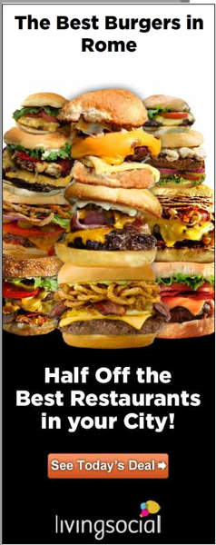

{.left} Y’know, seeing this advert at a certain [site](https://www.washingtonpost.com/doonesbury/) almost every day is putting me off visiting that site again in future, because the entire premise is so very wrong on so many levels.
