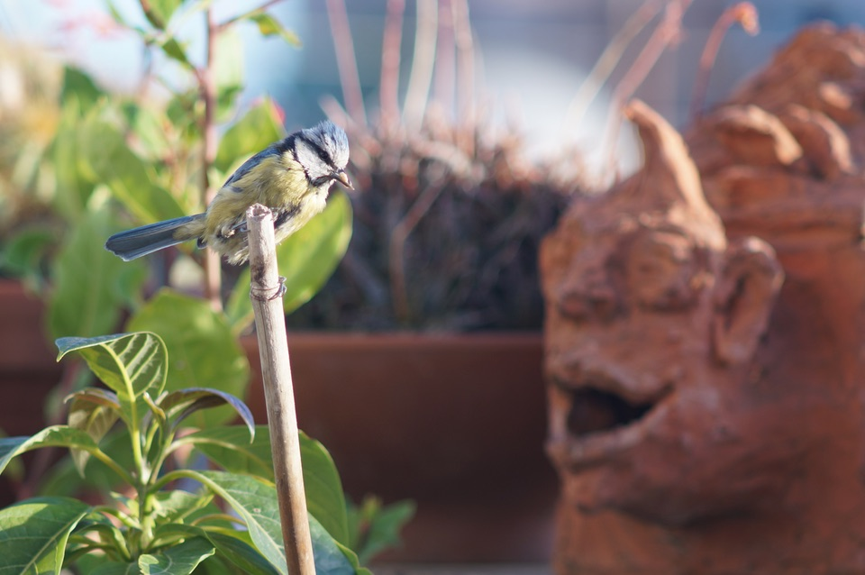

[{.center}](tit2-large.jpg)

The excitement, last year, of having a pair of blue tits choose to make [a home in a sculpture](https://www.jeremycherfas.net/blog/tits-update) on the terrace was huge. How much more exciting, then, to have them (or others) return this year? It was a much cooler and wetter spring, with fewer opportunities to take pictures, and when I finally sat down to do it I had no idea that the nestlings would fledge within the next couple of days. We briefly saw a couple of babies stumbling around and then everyone was gone. Safely, I hope.

For the record, then, two pictures from 8 May 2021.

[{.center}](tit-large.jpg)
