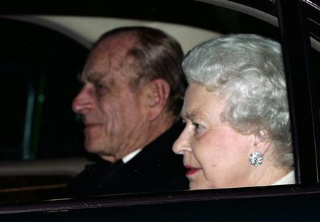

{.center}

> The Queen (R) and Prince Philip, the Duke of Edinburgh, arrive at Kew Palace in Kew Gardens for a private family dinner to celebrate the Queen's 80th birthday, April 21, 2006. REUTERS/Luke MacGregor

What truly appalls me about the [lead photo]~~http://uk.news.yahoo.com/27052006/325/photo/queen-r-prince-philip.html~~ on Yahoo News UK & Ireland today is the sheer bare-faced cheek of them stealing one of **my** joke captions.[^1] When I was an editor on an august weekly of novel science, I ran a story about noted biophiliac E.O. Wilson -- on the close relationship between _Homo sapiens_ and _Gorilla gorilla_ -- with an accompanying photograph of Wilson with a gorilla.  I wittily captioned it “Harvard biologist Wilson (left) with a gorilla”.

I expect others have given in to the same childish urge, but not in relation to the monarchy, surely. Reminds me about that joke about photographers and queens, but not enough to retell it here.

[^1]: 2022-06-03: Link dead, because Yahoo, although I am happy I captured a screenshot.
