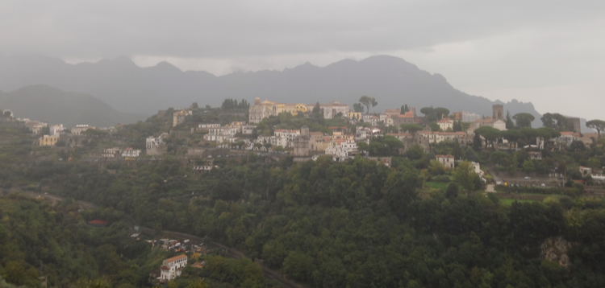
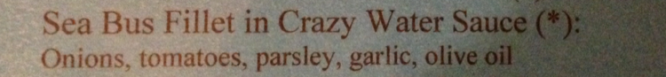

{.center} 

We spent a wonderful weekend at Ravello, on the Amalfi coast, gorgeous despite rain on and off all day Saturday. Among the delights, one of the best menu manglings ever.

===

{.center}

We didn't try that, having been tempted instead by a local pasta, whose name I inconveniently forgot to note, and the plain grilled sea bass.

Among other delights, visits to the [Villa Cimbrone](https://en.wikipedia.org/wiki/Villa_Cimbrone) and, even more thrilling, to Gore Vidal's home at La Rondinaia. Further documentation will have to wait.

But the really deep thought is this: why is it that on a narrow urban street, designed for maybe two lanes of traffic in either direction, Italians will somehow use three, while on a broad stretch of motorway, with three fine lanes available, all the traffic will be in the leftmost lane, while the right will be empty?

Don't even attempt an answer; there isn't one.