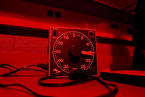

[{.left}](http://flickr.com/photos/raybland/138666298/) It’s all about definitions, this thing. What is an “art”? I taught myself to take, develop and print monochrome photographs. Not entirely by trial and error -- some books were involved -- but there was no human in there telling me what to do. At least, not until I’d taught myself enough to know how little I knew.

Other arts? Is gardening an art, or a craft? How about editing sound? That’s craft, for sure, but the end result may well be a piece of art. I don’t see how anyone can get through life without teaching themselves an art. Even blogging.
