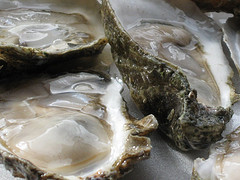

[{.left}](http://flickr.com/photos/99805939@N00/2958443799/) Hard to know, without a touch of forensic microbiology. But yeah, I’m pretty confident that I’ve been there, more than once. The oyster event was pretty tragic, projectile emissions from both ends in the presence of someone I’d only recently got to know. She was wonderful about the whole episode. Took me ages to taste another oyster because I wanted to be sure I had the time to be ill if it was allergic rather than pathogenic.

Does it count if you don’t puke? If so then two out of two visits to India, one of which required [hospitalisation](http://jeremycherfas.net/2005/04/26/facts/).

