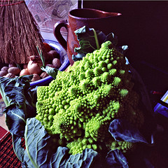

{.left} Back after a brief Christmas break. The story so far: a while ago, [I listed various things I had done](http://jeremycherfas.net/blog/lazy-blogging-just-one-of-the-things-ive-done/) in a lazy blog post. Now I’m expanding within the constraint of 100 words.

Where to begin? Yes, I have grown my own vegetables. And saved my own seeds. And sold them, and other peoples’. And written about all that, at length. And given countless talks to garden societies. And cooked the veggies, even the strange ones like Chinese artichokes and wapato and mashua. And worked for a couple of places that researched and promoted vegetable growing and vegetables diversity. And now where am I? On the 4th floor, with a lovely terrace but no real soil and a deep need to have a vegetable plot once again, before I’m too old to dig it.

_[The picture is mine.](https://flickr.com/photos/jcherfas/167158728/)_

