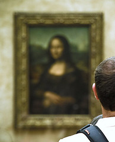

[{.left}](http://flickr.com/photos/gregory_bastien/2590108942/) Yes, but the details are sketchy. I know it was some time after the Pyramid thingy opened. And, like most people who have seen it, what I took away was how small the painting is. I mean, really tiny.

Of course one has no way of knowing how big it **ought** to be, having seen only reproductions, and never bothering to read the dimensions. But some pictures are just much bigger than you think they’re going to be, and others -- there’s a Picasso of a large woman -- are surprisingly tiny.

Big question: why should seeing the real thing -- badly -- be so important?
