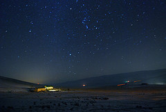

[{.left}](http://flickr.com/photos/rs_butner/2219615845/) No big deal. I mean, I was doing it this past summer, when things were too hot indoors, just stretched out on the terrace. Mostly I’d wake up in the middle of the night, cool enough to go back inside and sleep, but once or twice I made it to the dawn. I’ve always preferred waking up with a slow increase of the light. The big problem with star-covered sleep is temperature. If you can see the stars, you can radiate heat. That and the bugs. But given a soft base and warmth, there are few places I’d rather sleep.
