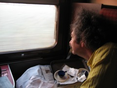

{.left} Most recently, just before Thanksgiving last year, the midnight train from Rome to Turin, and what a hoot it was. The cabin, with two bunks, was absolutely tiny. A basin was advertised, but we never did manage to find the space to use it. Simply getting in and out of the cabin, let alone the bunks, required careful choreography of a “no, put your leg there and I’ll go under it” nature.

But there is something magical about sleeping on a train and waking up, with a coffee, far away from where you were. Beats a short-hop flight any day.
