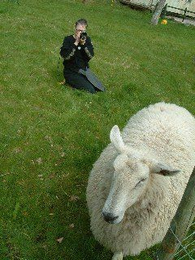

{.left} I used to have “land” and the ex got this fine notion to get some ram lambs from up on Mendip to keep the grass down in the orchard.

The Jackson Five arrived in a box and had to be fed replacement milk every four hours, or thereabouts. The ex did most of the work, but I took a couple of turns. She did a good job though, and so did they, at least when they weren’t scoffing rare vegetables or barking the trees.

So yes, I’ve held a lamb, often, and sat on its head when it needed shearing.

_Yesterday was a bit of a busy day, what with everything, but thanks to the magic of the interwebs I can play catch-up and you would never notice if it weren't for my inherent honesty._
