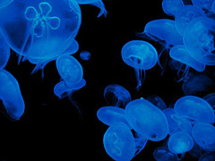

[{.left}](http://flickr.com/photos/psychoscheiko/378241096/) The best, and worst, skinny dip I can recall was the time I was filming in Vienna, where my mother happened to live, and the assistant producer and I went for a walk with my Mum by the banks of the Danube, or the Danube canal. It was quite a warm day, and Ma suddenly announced that she was going in. So in we went. I was a little bit mortified, but also quite proud of us. The assistant producer was pretty game too.

Swimming naked is glorious, and even better when there’s time to dry off properly in the sun.
