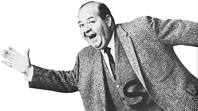

{.left} We got over singing “Blowin’ in the wind” instead of Christmas carols, and amazingly found ourselves on [Stubby’s Silver Star Show](https://www.imdb.com/title/tt1251369/fullcredits#cast), where The Man forced us to cut our high-concept version of [The Story of Bo Diddley](https://www.azlyrics.com/lyrics/animals/thestoryofbodiddley.html) down to 1:45 or less. And when the votes were in and counted, a girl beat us out with her version of Hernando’s Hideaway, which featured a bit of dancing as well as singing.

It was a time of transition, you understand, and Stubby’s audience wasn’t ready to transition with us. We broke up soon after, to pursue our individual artistic visions.
