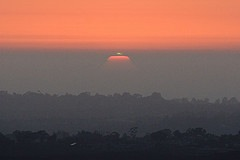

[{.left}](https://flickr.com/photos/kevlar/1155437164/) Sunsets are so much easier than sunrises. With a rum and water in hand (just a brief grating of nutmeg, thanks) every evening on a Caribbean island is a sunset watch. And very, very occasionally, a green flash special.

I think I prefer sunrise to sunset. Not that I sit around watching the sun rise. But on an early morning dog walk, you set off at night and return by day and at some point the sun must have risen. Get the timing just right and I do see the Sun appear over the Colli Albani, but the lightening is the thing.
