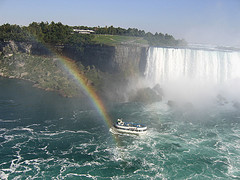

{.left}] The worst part was the smell of the oilskins. How many people had worn them before? In how many degrees of heat and humidity? Bad enough to have to put them on, moist and clammy at one and the same time. But to then have the funk of all that humanity waft on up was torture indeed. These days, searching Flickr, it seems they give you a disposable plastic poncho.

It was the Summer of Love, honest to God, and my first trip to the US, to Vermont. We made it there and back in a day, [see TID 22](https://jeremycherfas.net/blog/tid-22-hitch-hiked/).

!!! 2022-01-23: The photographer has dumped their Flickr page. Thanks anyway.