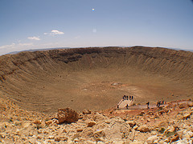

[{.left}](https://flickr.com/photos/verismovita/458435905/) August a couple of years ago I was far enough away from city lights, and the shower was at a reasonable hour, that I did see more than a handful of the Perseids. Exciting though it was, I wish instead I could say that I had seen the aurora borealis. Now there’s a heavenly phenomenon to reckon with. Sure it is good to see a star streak across the sky, but the [movies](https://www.youtube.com/watch?v=qIXs6Sh0DKs) and written accounts of those shimmering curtains of light make me hope that one day, before too long, I’ll be able to say I’ve watched them too.
