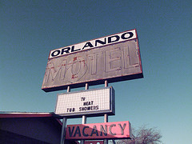

[{.left}](http://flickr.com/photos/curtisperry/136269463/) On my first trip to the US my new-found friends and I went to Walt Disney World. I wasn’t impressed. EPCOT was a bit more interesting, but I still had the feeling that it was a substitute for actual travel. Years later I went back on someone else’s dime, and had the horrible experience of being robbed at a “Christian” motel in Orlando. Not just Gideon bibles but all manner of inspirational crap littered the place, and a turquoise and silver bracelet vanished from my room. I might not have harboured a grudge, had the management not insisted I was lying.
