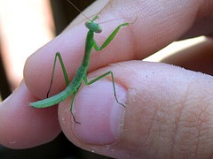

[{.left}](http://flickr.com/photos/blockpartypress/2583567037/) They weren’t this tiny. And yes, that’s a plural. They used to be quite common where I lived, and crazes waved through the school periodically. Same for silkworms. And, in later life, stick insects. Parents desperate to place some of their kids’ babies with a new and loving home. Cleaning out the tanks was the most fun, because you had to [count them out and then count them all back in](http://news.bbc.co.uk/onthisday/hi/correspondents/newsid_2626000/2626477.stm). And save the egg cases, so you could inflict them on someone else.

Mantids are wonderful, all bulging eyes and swiveling heads, but I never actually kept one.

