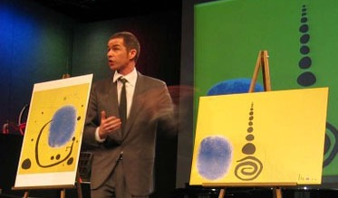
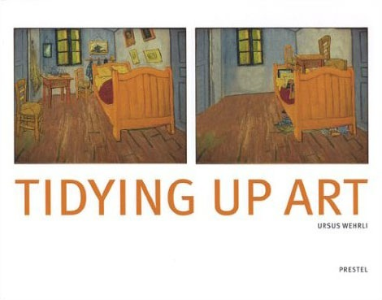

{.center}

It isn’t often that a TedTalk provokes actual belly laughter. Snickers yes, sometimes an appreciative titter. But outright guffaws? I can’t remember too many, and certainly not sustained through an entire presentation. Ursus Wehrli managed it, in a talk filmed in February 2006 but only [recently uploaded](http://www.ted.com/index.php/talks/ursus_wehrli_tidies_up_art.html).

The premise is simple. Much (modern) art is not very tidy. So Wehrli tidies it up.[^fn1] And he is very, very funny with it. As soon as I stopped spluttering long enough to tell The Squeeze she asked “What’ll he do with Jackson Pollock?”. I couldn’t think. But do him he does, although I won’t give the game away. He also does some older pieces, including a Breughel and Vincent’s bedroom at Arles: “At least now you can do some vacuuming.”

{.center}

Why is this so funny? Because we all know about the Swiss and orderliness. Wehrli plays on his own Swissness beautifully. But also because we share in the joke; these are not obscure works. They are well known, and we “ought” to appreciate them, even if we don’t fully understand them. I wouldn’t be surprised if lots of people actually find the tidied up versions more attractive. I know I did, at least for some of them.

That may also be why Einstein’s untidy allotment is sprouting all over the blogosphere. Can the person with the famously untidy hair also have had a famously untidy plot? Yes, and [this seems to be where it started](https://backreaction.blogspot.com/2007/05/einsteins-garden.html).

[^fn1]: The photo shows a Miro and Wehrli’s version. I got it from [Christopher Herot’s web site](http://herot.typepad.com/), with permission, and cropped it. Thanks Christopher. 
