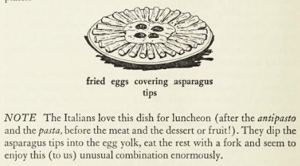

{.center}

Like the bourgeois gentleman I aspire to be, today I learned that asparagus topped with a fried egg, which I eat at every opportunity during the season, has an actual name. It is, apparently, Asparagus Bismarck.

I learned this from Elizabeth Minchilli, doyenne of people who write about La Dolce Vita. I knew about Bismarck herrings and about sausages and Bismarck, but not about Asparagus Bismarck. So, why the name? Elizabeth, alas, [has little to say](https://www.elizabethminchilli.com/2021/04/asparagus-bismarck/):

> I’m not really sure how this simple dish got this fancy name. But is it one of my favorite things to order in old fashioned restaurants all over Italy. Or, these days, to make at home.

## Challenge accepted.

Wikipedia, to my surprise, was absolutely no use to begin with. Looking further afield, an [Italian website](https://www.pilloledistoria.it/2310/storia-moderna/sandwich-pizza-margherita-carpaccio-scopriamo-lorigine-alcuni-celebri-piatti?lang=en) suggested only that chefs of the time dedicated many dishes to the great statesman “as a thank you for the achieved unification of Germany”. Yeah, no.

If you visit that site and are puzzled by the description of Bismarck as “an excellent fork”, know that the original Italian — un’ottima forchetta — is better translated as a hearty eater, or similar.[^2] And that prompted vague recollections of Bismarck being a great one to eat many boiled eggs, the Cool Hand Luke of Prussian statesmen. Which set off another search. 

_The Food of Italy and How to Prepare it_ by Edwin H. Knopf and Mildred O. Knopf, published in 1964 by Edwin’s brother Alfred, gives a recipe, an illustration, and a bit of information, but nothing on the name.

{.center}

Ah, those quaint foreigners.

Another cookbook turned up the idea that in Italy, “all dishes that are topped with a fried egg” are _alla Bismarck_.[^1] But again, no explanation why they are called that.

I was about to give up when Luigi, roped in to the hunt as usual, turned up this recipe for [Bismarck Pizza](https://www.tasteatlas.com/bismarck-pizza), which, unlike sausages, I would be happy to watch being made, less so to eat. Anyway, that says: 

> The name of this pizza hides an interesting story, since Bismark is not an Italian name or word. In 1862, the Prussian Prime Minister Otto Von Bismarck delivered a speech in Italy where he said it would take “blood and iron” to effect change. The phrase was mistranslated as “blood and eggs”, and Otto got a pizza named after him.

Of course, [the blood and iron speech](https://en.wikipedia.org/wiki/Blood_and_Iron_(speech)) is famous, but “delivered in Italy”. I think not. And even if he did, how do you get from _ferro_ to _uova_. If however, he actually said _Blut und Eisen_ — which he did — then it isn’t quite such a stretch from _Eisen_ to _Eier_ and from there to _uova_.

If you know different, please let me know.

[^1]: Faith Willinger (1999), Red, White and Greens: The Italian Way with Vegetables. William Morrow Cookbooks, p. 53

[^2]: See, for example, [The Dietary habits of Otto von Bismarck](https://hopefulgeranium.blogspot.com/2014/11/the-dietary-habits-of-otto-von-bismarck.html).

