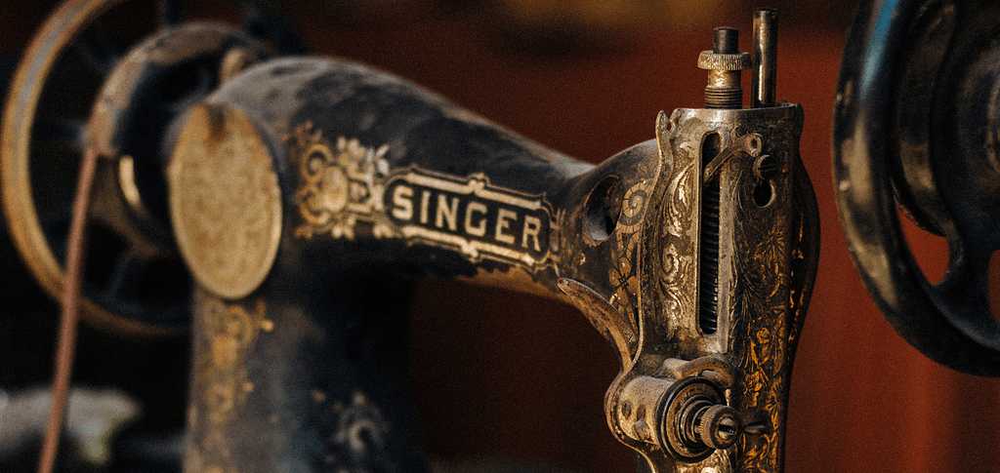

{.center}  

Finally, late this afternoon, I found time to watch the video of [a talk by Ethan Marcotte](https://newadventuresconf.com/2019/coverage/ethan/) that <a class="u-in-reply-to" href="https://adactio.com/journal/15260" >Jeremy Keith had recommended.</a > 

> [Y]ou really must watch it. Don’t multitask. Don’t fast forward. Set aside some time and space, and then take it all in.

I did. Set aside the time, watched and only watched, at normal speed.

It was well worth it. A beautifully crafted talk, superbly presented, all one could wish for, thought-provoking and stimulating. And of course I could just leave it at that, an unalloyed "Like".

Two things, however, call for more.

The first is that to even pretend that the sewing machine could end poverty is to buy into a very dubious proposition, on two counts. There will always be poor and not so poor, and even the UN's poverty line is adjusted from time to time to reflect that despite rising tides and all that, some boats just remain lower in the water. More importantly, while the sewing machine may not have ended poverty *globally*, it has most definitely helped an awful lot of people improve their lot. Ethan showed pictures of white folks working in sweatshop conditions, possibly even in the notorious Triangle Shirtwaist Factory. Yes, they were exploited. But they did have a job and an income. And then the factories were exported to poorer countries where the same machines and their successors gave the same sorts of people their first step out of absolute poverty. And the process goes on, the poor countries that once housed the sweatshops now affluent enough to buy the cheap clothing produced in the new sweatshop countries. I think the sewing machine did end poverty, for many people.

The second is a technical niggle, but an important one given what Ethan was saying about accessibility. My hearing isn't 100%, or 20:20, or whatever perfect is when it comes to audio. I found the sound as it emerged from my monitors full of echo. Headphones were better, but it was still obvious that the left channel was a nice, close mic while the right was who knows where picking up almost exclusively reflections. Sure, I could have done a lot more tweaking and just duplicated the left channel, but Jeremy said not to get distracted, so I stuck with the headphones. None of this is the speaker's fault, of course. But I do wonder, did anyone else have problems with the audio?

Now, of course, I need to find the time and space to work my way through [the rest of the programme](https://newadventuresconf.com/2019/conference/).

Photo by <a href="https://unsplash.com/photos/RTEbHyyZtnU">Adolfo Félix on Unsplash</a>
