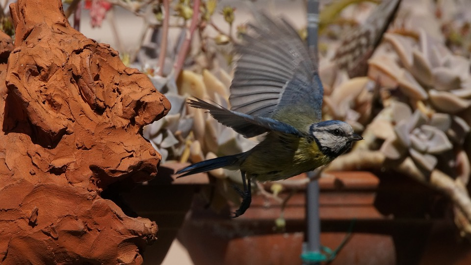

---
title: 'Tits update'
published: true
date: '03-05-2020 11:14'
taxonomy:
    category:
        - blog
    tag:
        - General
        - Photo
summary:
    enabled: '1'
subhead: " "
header_image: '0'
--- 

Lovely morning for just sitting quietly in the sun waiting for the birds. And what a difference a bit of sun makes, because these were shot at 1/2000, which certainly helps.

[{.center}](tit-3-2020-05-03-1920.jpg)

[{.center}](tit-4-2020-05-03-1920.jpg)

There are absolutely, definitely nestlings present, but I have not heard a single chirp, nor do I want to spoil things by shining a light inside the head.
