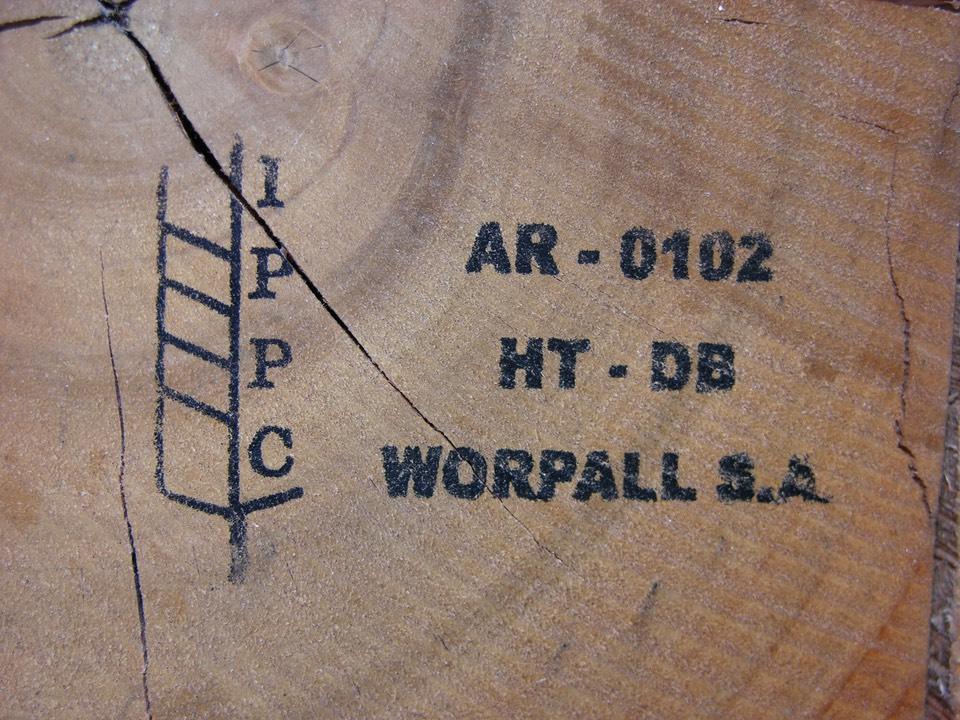

[Whitewood under Siege](https://www.cabinetmagazine.org/issues/52/hodes.php) is a cracking good article in Cabinet Magazine on, as the subhead would have it, “the front lines of the pallet wars”. Pallets are one of those things most people seldom think about, except perhaps when they are on the lookout for cheap, hip-ish raw materials. And yet, 

> [M]any experts consider the pallet to be the most important materials-handling innovation of the twentieth century. Studies have estimated that pallets consume 12 to 15 percent of all lumber produced in the US, more than any other industry except home construction.

===

The article will bring you up to speed on the history and future of pallets, but I was a teeny bit surprised by one omission. Although the article mentions a juicy legal scandal that swirled around dubious claims that “wooden pallets harbored *E. coli* and other bacteria, representing … a ‘pervasive threat’ to the food supply,” it says nothing about the threat pallets pose to global forests, and not just as raw material.

{.center}

This mark on a pallet (from Argentina) means the timber has been treated.

What little I know of pallets I learned while working for a client charged with reducing the spread of plant pests and diseases. Pallets are just one form of “wood packaging material in international trade,” which is a huge global risk. Emerald ash borer, for example, pinewood nematode and Asian longhorn beetle almost certainly invaded new areas by hitching a ride in the wood of pallets and crates. Given the devastation that invasive pests can wreak on forests there are, not surprisingly, international efforts to agree standards for sterilising wood packaging material. Equally unsurprising, some of those standards haven’t been agreed after more than a decade.

 That’s one problem plastic pallets do not have.