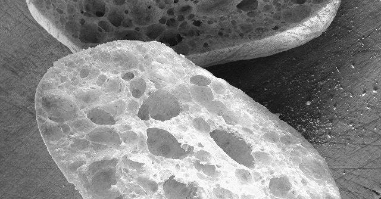

{.center}

The one thing to be thankful for in the rise of fast factory bread is that it prompted the resurgence of small, artisan bakers. They have been goaded to produce breads that are better in every way than even the best breads of years gone by. It may seem at times if their focus is on traditions from time immemorial. It isn’t.

Because aside from taking time, what they are doing isn’t all that traditional.

<a href="https://www.eatthispodcast.com/our-daily-bread-25/" rel=canonical>Listen to Tradition! at Eat This Podcast.</a>
