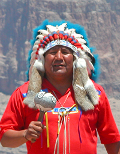

{.left} Colleagues generally ignore advice received. So it was with an almost palpable shudder of revulsion that I read a recent email. New to me, it contained modern management advice that casts aside ancient and hard-won knowledge, to whit:

<blockquote>The tribal wisdom of the Dakota Indians, passed on from generation to generation, says that “whenever you discover that you are riding a dead horse, the best strategy is to dismount”. This is silly, when there are other, far more productive options:
1. Changing riders.
2. Appointing a committee to study the horse.
3. Arranging a visit to other countries to see how others ride dead horses.
4. Lowering the standards so that dead horses can be included.
5. Reclassifying the dead horse as “living impaired”.
6. Hiring contractors/consultants to ride the dead horse.
7. Harnessing several dead horses together in an attempt to increase the speed.
8. Providing additional funding and/or training to increase the dead horse’s performance.
9. Doing a productivity study to see if lighter riders would improve the dead horse’s performance.
10. Declaring that as the dead horse does not have to be fed, it is less costly, carries lower overheads, and therefore contributes substantially more to the mission of the organisation than do some other horses.
</blockquote>

To which, after a thorough consultancy that involved, oh, 6 minutes on the [internet](http://www.professortangent.org/humor.shtml#horse), I can add a couple of others:

<blockquote>
10. Buying a stronger whip.
11. Threatening the horse with termination.
12. Rewriting the performance agreements for all horses.
</blockquote>

And, of course, the ultimate solution:

<blockquote>
14. Promote the dead horse to a supervisory capacity.
</blockquote>

Need I add that in this modern age, 14 is far too few recommendations for any self respecting consultant’s report; there’s little I can do about that.

Need I further add the phrase “flagellation, bestiality and necrophilia”? Not merely to score that all-important page-rank, but also to set up the old punchline: “am I flogging a dead horse?”.

De-motivated, moi? Heaven forfend!

! flickr photo by [Old Shoe Woman](https://www.flickr.com/photos/judybaxter/2214294/). 
