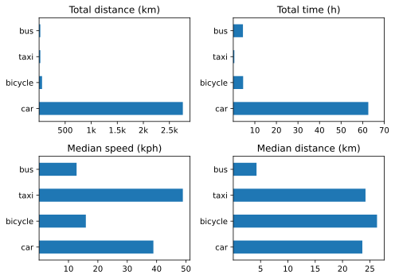

The quarter of the car.

===

## Bicycle rides
Q2 — A very pathetic four rides, with none in either July or September. My excuse is simple; I did not have a bike with me, and had lots of fun despite that.

## Other transport 2024 Q3

{.center}

Changes from [last time](https://www.jeremycherfas.net/blog/transport-summary-q2-2024) include:   
* Use of the car on holiday, and that doesn't include use of hire car in September.
* Median car trip shorter than median bicycle trip!

Despite my misgivings about these graphs last time, I have not taken any steps towards improving matters. I have the data, I ought to be able to make better use of them.

I also feel I ought to learn how to use the trip data reset on the car to figure out and record kpl numbers for the quarter.

