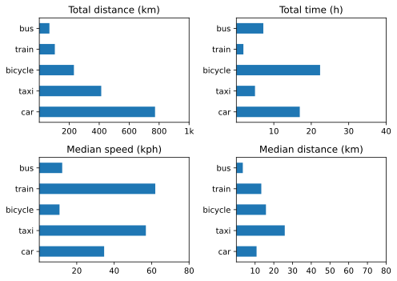

Strange but true. Last quarter I wrote “Getting the data out was easier too, having written myself an *aide-memoire*”. Could I find it this quarter? Of course not. Still, the basics were reasonably easy to recall. I really do want to improve the way I deal with the months of a quarter. I know there is a better way, I just have not made it a priority to implement the better way. Because, good enough.

Anyway, here we are.

## Bicycle rides 2024
* Q1 — 9 rides totalling 241 km; 26.8 km per ride. Less than one a week, alas, but distance is encouraging.

## Other transport 2024 Q1

{.center}

Changes from [last time](https://www.jeremycherfas.net/blog/transport-summary-q4-2023) include:   
* Less train, more car.
* A lot more bicycle.
* Not much change in median distance.

These comparisons are less than satisfactory, and I would like to think about other ways of looking at trends over time and averages without getting too much into the weeds over things like seasonal differences.
