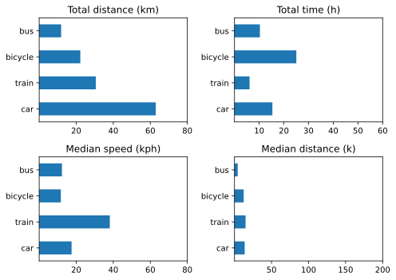

Having done the heavy lifting to analyse Q1’s transport data, the only hard part today was to remember which bits did what. To that extent, the whole assembly is still manual till it hurts, which honestly isn’t much.

{.center}

Changes from [last time](https://www.jeremycherfas.net/blog/first-quarter-transport-summary) include:  
* No car2go
* Not nearly as far in all modes
* Car only just faster than bus or bike

There were two flights, I admit, and a couple of taxi rides too.

Again, no great takeaways aside from my ludicrous car ownership, which I justify by pointing out how little I use the stupid thing. But when I want to use it (as I do in July, for sure) it is very handy simply to own it. What price convenience?
