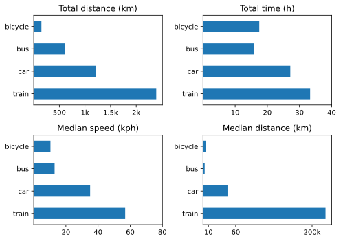

A good quarter for trains and bicycles, and taking the train to ride the bicycle.

## Bicycle rides
Q2 — 18 rides totalling 467 km; 25.9 km per ride. More than once a week, on average, which is nice. Included the glorious 95 km of [Treviso–Venice](https://www.jeremycherfas.net/blog/brompton-world-championships-2024#:~:text=Treviso%20to%20Lido%20di%20Venezia) and the perverse 55 km lunacy of [Rome-Bracciano](https://www.jeremycherfas.net/blog/absolute-madness).

## Other transport 2024 Q2

{.center}

Changes from [last time](https://www.jeremycherfas.net/blog/transport-summary-q1-2024) include:   
* More train **and** more car
* A lot more bicycle.
* Median distance highly skewed by train.

Still not entirely convinced by the value of these graphs. Certainly, they do show that I mostly use the car for longer trips, which is a good thing. But there's no real indication of how often I use each mode, so I'm still thinking about other ways of looking at trends over time and averages. Maybe a sparkline of distance per day per mode, with an indication of number too?

The other problem, of course, is the reliability of the data. I try to remember to record every trip with Overland, and that has become a lot easier since I discovered that I do not have to be tracking in order to record an actual trip. Still, I know I miss some.

