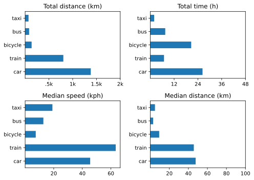
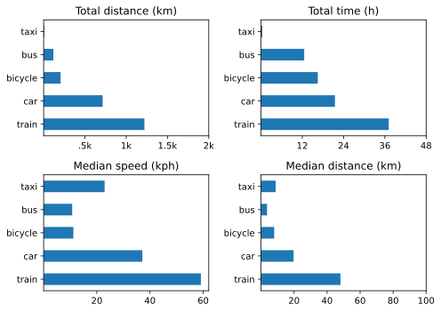

Proof that this whole effort is too complicated for its own good is right here: I completely failed to do Q1 before Q2 was upon me. The reasons are many, and considering them in more detail, along with the data I would actually like to be aware of, might help to streamline things going forward. But let’s get the data out of the way first.

===

## Bicycle rides
Q1 — 11 rides.
Q2 — 14 rides, including the lovely session in the Po delta. One of those per quarter would be a fine thing indeed.

## Other transport 2025 Q1

{.center}

Changes from [last time](https://www.jeremycherfas.net/blog/transport-summary-q4-2024) include:   
* More driving, mostly getting to Sicily.

## Other transport 2025 Q2

{.center}

Changes from Q1 include:   
* Train beats car, as it should.
* Bicycle as fast as bus? 

## Rethink

The biggest single problem with all this is my own unreliability. Overland does a great job of tracking, but only if I remember to start and stop each trip correctly, and I don’t always. I track only trips, rather than my position all the time, to save battery, and that’s good because it is simpler. 

The data file contains two kinds of records. There are the very many individual location records and the few trip summaries. I have a set of (probably unnecessarily) complicated Python scripts for extracting only the trips and then summarising the data to produce the graphs, and it is only when I generate the graphs that I can spot outrageous anomalies. Did I really spend more than 6 days on my bicycle? Of course not. It is easy enough to go into the extracted trip data, find the anomalies and adjust them with reasonable accuracy. Inspection also reveals exactly duplicate entries that are probably the result of my unwise code, and they’re easy enough to delete too.

In the end, though, what are the numbers I really care about? Total distance is interesting, and so is median distance, I think. Total time helps me spot anomalies because any time I forget to stop a trip it is going to show up in an unexpectedly large time, but it doesn’t need to be in the final graph I share here (except that a 2 x 2 grid is visually satisfying). And if I could record those mistakes when I make them, and correct them within a day or two, I wouldn’t need to graph that. Median speed is informative only as far as the ranking almost never changes, except when there are a few good fast bicycle rides. Maybe what’s missing that might be interesting is simply the number of trips per mode of transport which, I noted some time ago, could be done in Python with `counter`.

The answer, then, is more mindfulness; about starting and stopping trips, and about noting and correcting mistakes promptly.

## Rethought
That didn’t take too long, and it wasn’t too difficult either. In fact, formatting the output was the only difficult part (and this may not look good to begin with, but it is a start).

| Mode | Q1 | Q2 |
| ---: | :---: | :---: |
| Bicycle | 11 | 14 |
| Bus | 26 | 28 |
| Car | 11 | 19 |
| Metro | 4 | 0 |
| Plane | 1 | 1 |
| Taxi | 6 | 1 |
| Train | 7 | 9 |
