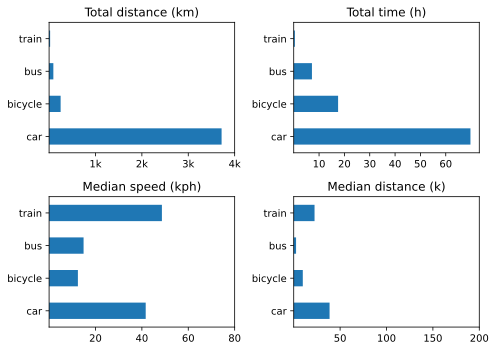

Been thinking about these data, and generally concluded that speed is a very crude measure, depending as it does on starting and stopping tracking at the correct times. That’s OK for mechanised transport, usually, although I do tend to leave it running as I hang around at a bus stop waiting for the next bus, because I reckon it is the average trip speed that matters. On the bicycle, though, I tend to pause the workout on my watch but leave the overall track running. Average speed from Compass is thus very different from average speed from the watch. No big deal.

===

To deal with that, I remembered that [Datasette](https://datasette.io/) can offer all sorts of insights into data exported from Healthkit. Problem was, Healthkit exports every single datapoint during a workout, one every couple of seconds, with the distance between them, rather than an overall cumulative distance for the whole workout.

OK, time to roll up my sleeves and enlist ChatGPT. That showed me how to get the sum of all the records on a particular day (which could be narrowed down further). But did I want to get into saved SQL Queries? I did not. So I asked ChatGPT to help me do it in Python. Reading direct from the database proved too difficult for us, so we decided to export the necessary fields from the database as CSV.

```
cd ~/datasette-data`
 
sqlite3 healthkit.db
sqlite> .headers on
sqlite> .mode csv
sqlite> .output cycling.csv
sqlite> SELECT startDate,
   ...> value
   ...> FROM rDistanceCycling;
sqlite> .quit
```

After that,[^1] a Python program to sum the distances for each day and write them out to a file was not difficult. And that revealed:

[^1]: And there are ways to make that a script.

* Q1 — zero across the board!
* Q2 — 9 rides totalling 133 km; 14.7 km per ride. Not too shabby.
* Q3 — 14 rides totalling 215 km; 15.4 km per ride. A tad better.

I don’t actually think that average ride length is going to change all that much, but I do hope that I can increase the number of rides.

As for the rest, here it all is.

{.center}

Changes from [last time](https://www.jeremycherfas.net/blog/transport-summary-q2-2023) include:  
* The ticks on the abscissa of total distance were, as now seems obvious, completely wrong. Multiply by 10.
* Much further by car, because we took it for two holidays.
* That is also why car median speed is higher; motorways.
* No huge changes in median distance.

No flights, and two or three taxi rides.

Car ownership is still ludicrous, and renting would probably save money, if it weren’t so darned awkward.
