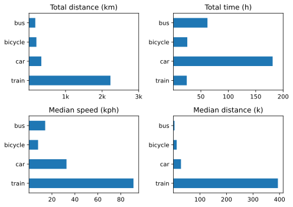

Enjoyed some long train rides this quarter and endured some flights. Getting the data out was easier too, having written myself an *aide-memoire*.

## Bicycle rides 2023
* Q1 — zero across the board!
* Q2 — 9 rides totalling 133 km; 14.7 km per ride. Not too shabby.
* Q3 — 14 rides totalling 215 km; 15.4 km per ride. A tad better.
* Q4 — 10 rides totalling 109 km; 10.9 km per ride. Is winter a good enough excuse?

## Other transport 2023 Q4

{.center}

Changes from [last time](https://www.jeremycherfas.net/blog/transport-summary-q3-2023) include:   
* Train to the fore! Trips to Nürnberg, Venice and Bologna.
* More bicycle.
* Total time in car is surely wrong.[^1]
* No huge changes in median distance (except for train).

[^1]: This is an ongoing problem with Overland; there are times when I forget to end a trip. If I remember, I sometimes go in and delete the offending record, but it isn't easy either to remember or to delete cleanly.

Three flights in all, four Car2Go and one taxi ride. Also ten boat trips, because Venice.

Car ownership remains absurd and comfortable.
