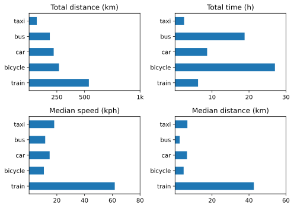

Normal service has been resumed.

===

## Bicycle rides
Q4 — Ten whole rides; not enough, but better than Q3.

## Other transport 2024 Q4

{.center}

Changes from [last time](https://www.jeremycherfas.net/blog/transport-summary-q3-2024) include:   
* Much less use of car
* Good train rides, to Venice and elsewhere.

Still have not done anything to figure out how to use the trip data reset on the car to record kpl numbers for each quarter.
