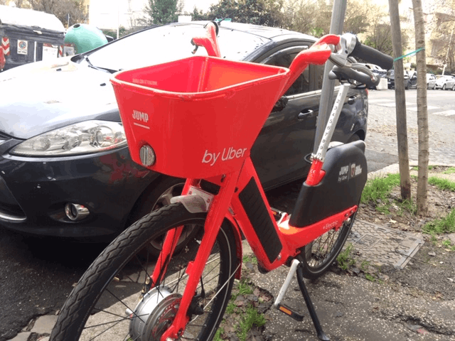
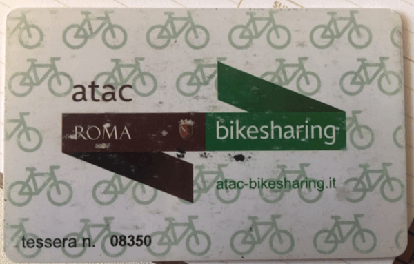
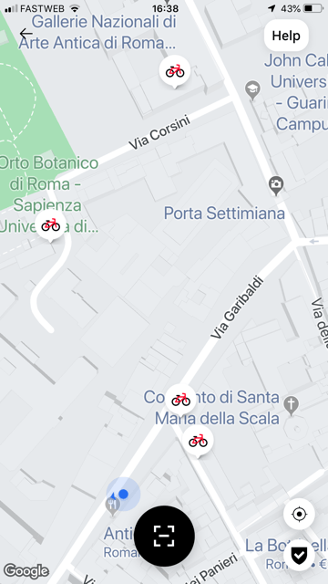

{.center} 

We've seen our share of bike-share schemes here in Rome. First, there was the city's own scheme, with fixed parking places here and there and clunky great bikes. You had to go to Termini Station and spend a while in line (with all the correct paperwork) to get a plastic card that might, or might not, unlock a bike. The bike's tyres might, or might not, be inflated. Etc. You get the picture.

{.center} 

That scheme died an unlovely death.

Then came a couple of the Chinese efforts, no longer tied to fixed parking places and with an app to unlock them. I didn't try those, although I did take note of individual dead bikes here and there. 

Those bikes vanished in their turn.

The latest effort comes from Uber. These bikes have an electric motor to assist you going up hills, and are also parkable anywhere; blocking pavements, lying down in the street, halfway through the park. This is still Rome, after all.

I was planning to ignore those too, until a friend waxed lyrical about how easy they are to use. No additional app; if you have Uber on your phone, you're good to go. No trouble unlocking the bike, and the motorised assist just works. You peddle, it assists. So yeah, I thought I would give it a try last Sunday afternoon. And that's when I hit a snag.

The app usefully shows you where all the bikes are. Great. So I walked, in turn, between each of the four bikes shown on this screenshot. Not one of them was visible.

{.center} 

My theory is that people are taking a bike inside their building and locking it up there. That way, you stop paying by the minute, and -- bonus! -- you don't have to worry about finding a bike next time. Sharing? Fuggeddaboutit!

I did eventually find a bike that was usable, and used it, and I have to say my friend was correct. It is easy and whizzes you up the hill nicely. In fact, I have now taken two trips, and they were both a lot of fun. More expensive than a bus and a shared car, but better for you, even with the motor.

Perhaps Uber Jump bikes will be the ones to buck the trend and survive, if they can find a way to keep them on the streets and available to share.
