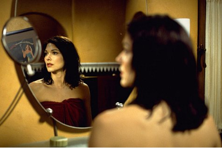

{.center}

Maybe it was the setting. The Villa Medici, above Rome's Piazza del Popolo, is a wonderful building, sometimes open for art and music. This year, last week, they showed films in the courtyard. The theme was the dark side of Hollywood, and on Tueday that meant [Mulholland Dr.](http://imdb.com/title/tt0166924/). You're wondering, how can a man reach my advanced years and not have seen it? Especially when his great friend Rob gifted him with a VHS copy? Just useless, is what I am. Equally, I have nothing to add to the critical acclaim. It is simply wonderful, and no amount of analysis can convey that. Is it true? Yes. Is it all in her head? Yes. Which bits are real and which imaginary? All of them.

{.center}

As I say, maybe it was the setting, with the umbrella pines silhouetted against an inky sky and the dome of St Peter's off in the middle distance. The incongruity of a movie all about artifice in a place like that is hard to overstate. Then again, maybe it was just the hot lesbian action. 

My rating: 5 out of 5