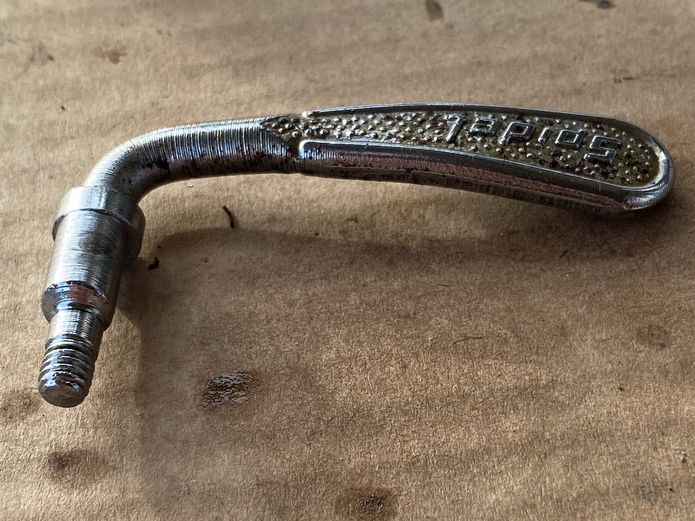
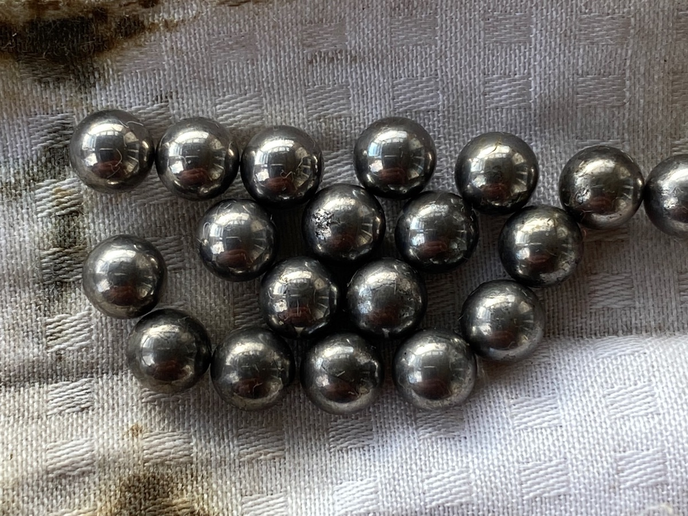

Another day, another unbalanced set of bearings.

While I wait for a freewheel removal tool to appear, I turned my attention to the front wheel, starting with the axle. This proved relatively easy to get undone, although there was some rather strange fibrous material that seemed to be trapped in the cup and cones, almost like an old-fashioned plumber had used hemp instead of teflon tape on a thread. Getting the notched spacer washers off was also a bit of a fiddle. In the end, everything came apart and was duly cleaned and, to some extent, polished, which revealed that along with the Maillard hub, there was a Spidel quick-release spindle.

{.center}

That prompted me to read up [a bit about Spidel](https://thevelocollective.com/the-short-history-of-spidel/) and a sorry story it is too. What with the Sachs-Huret downtube shifter mount and now this, my old Raleigh seems to be an homage to a cluster of no longer extant Franco-German component manufacturers. Looking around, I sometimes fantasise that if I sold each of those bits for what they seem to get on eBay, I’d have enough to buy a ready-restored bike. But it wouldn’t be mine.

{.center}

Once again, I am surprised to see that the axle bearings were unbalanced, nine on one side, ten on the other. Did bike builders just not care about that sort of thing back in the day? Or was it just my bike builder? Anyway, taking that photo reveals that some of the bearings are quite pitted. As nobody is likely to sell me a single 3/8" bearing, I suppose I’ll just end up replacing them all. And while I’m about it, I may as well order new bearings for the headset, the bottom bracket, the pedals and the rear axle (if I ever get to it).

I wonder what old ball bearings fetch on eBay?

