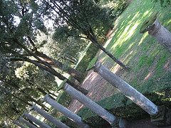

{.left} Wonderful expedition yesterday to the [Villa Lante](https://www.gardenvisit.com/gardens/villa_lante), “the consummate example of the best period in the history of garden design: the Mannerist phase of the Italian renaissance”. A very fine garden it is too, made even more enjoyable by a glorious autumn day with just a hint of chill in the air.

This post, however, is not about the gardens but about the total mess I got myself into trying to geotag them. I’m not exactly sure what happened, but somewhere along the line the metadata got entirely corrupted such that none of my recently discovered tools could read the data or fix it. That meant exploring yet more tools, and I did eventually solve the problem, wobbling in and out of XML files and other such voodoo, albeit at the expense of the rest of the EXIF data. _Tant pis_.

Alas, the new version of PictureSync, whose praises I had sung so lavishly before, did me no good whatsoever; some meaningless error about not being able to set something or other to true nagged away every time I tried to do anything. Luckily I still had the old version on the laptop, but it will be nice when everything just works.[^1]

Anyway, all fixed now. The set is [here](https://www.flickr.com/photos/jcherfas/sets/72157594320269191/).

[^1]: Which, of course, it does now very nicely, thank you.