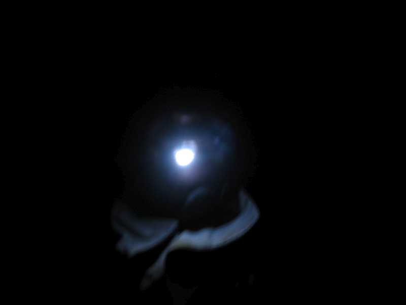

{.center} 

So here’s the [spooky story](http://jeremycherfas.net/blog/spooky/), continued. It was supposed to be just a walk. In fact, I had joked with friends about the North American habit of calling an English “walk” a “hike”. But we were both wrong. It was more than a walk. And it was quite a hike. I created [a set of photos](https://www.flickr.com/gp/73529121@N00/j79RAk) on Flickr, and when I started they had a narrative structure. But I screwed the upload, so they are not in order on my photo page, and if you view the set as a slide show you don’t see the thrilling story details. Maybe it is possible to re-order the images in my photostream, but I have not discovered how. No matter, I have another plan.
