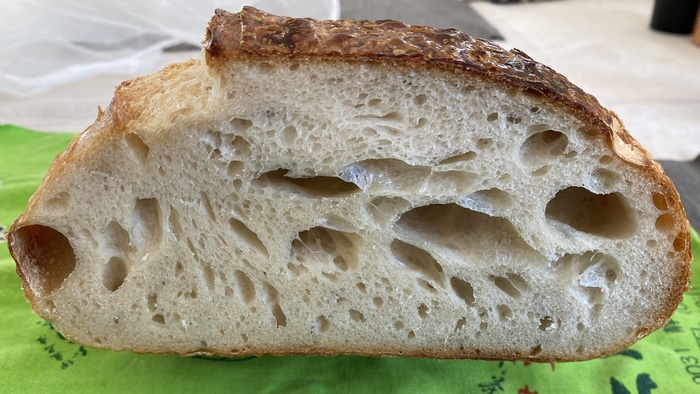

While I was away a friend gave me a copy of The Perfect Loaf, by Maurizio Leo, and very fortunately there was just about enough room in my suitcase to bring it home with me. Over at <a class="u-in-reply-to" href="https://www.fornacalia.com/2023/making-maurizios-simple-sourdough/" >my baking site</a > I wrote about baking his introductory Simple Sourdough, which proved to be an interesting exercise. Maurizio has an intent focus on temperature. He gives a desired dough temperature at every stage of every recipe, achieved by adjusting the temperature of water. If you do that, I am sure, then his timings also make sense and probably just work™. I tried, but as I noted in my write up, this place is just not suited to maintaining a decent temperature for the leaven or the bulk fermentation.

{.center}

You can see that the dough was underproofed, probably during bulk fermentation.

In the end, I noted a few additional technical wrinkles and several really interesting recipes. When I come to make them, though, I will probably stick with my own workflow and timings, based on what is, in my belief, the most important maxim in bread-making:

Watch the dough, not the clock (or the thermometer).
