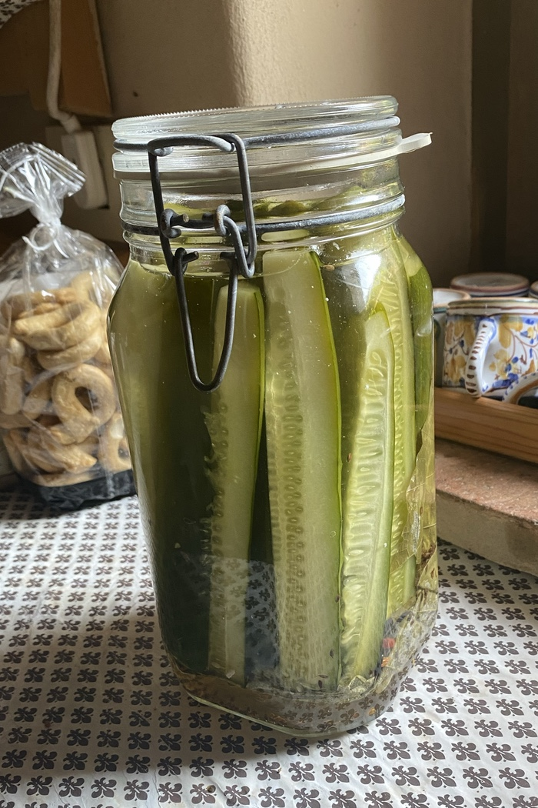

We are very fortunate to be staying at a friend’s place in the country, where the most onerous duty is not taking care of the cat — the ostensible reason for us being here — but keeping on top of the vegetable garden, and in particular the zucchini and cucumbers.

===

It is a pretty isolated spot, which means the old trick of driving into town with a basket of produce and depositing it on the back seat of anyone foolish enough to leave their car unlocked at the height of zucchini season will not work. So, yes, we have been eating a lot of zucchini every which way. The cucumbers are not quite so versatile, though they have found themselves in a fair few different salads, and they may yet tempt me into the labyrinth of smashed cucumbers. Then in the pantry I spotted a lovely big jar, complete with hinged lid and rubber seal.

Pickles!

The garden is blessed with grape vines too, so leaves were easy to come by. A quick refresher from a [previous attempt](https://www.jeremycherfas.net/blog/cucumbers-fermented-beautifully) to remind myself of the brine strength, and off we went, substituting a good amount of dill seed for the dill weed.

{.center}

They already smell great, and could be ready for a taste tomorrow or the day after. But I still have two and a half cucumbers left, and I haven’t even looked today.
