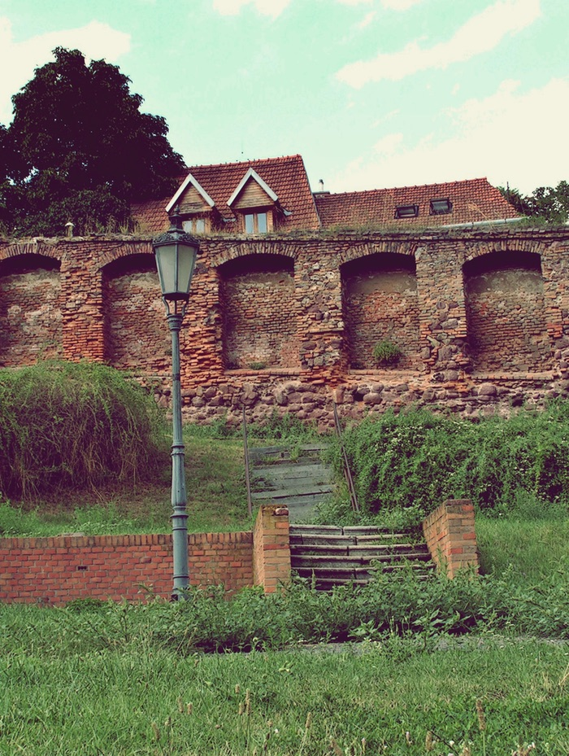

Twelve years ago today, I hosted an issue of Mendel’s Garden blog carnival [here](https://jeremycherfas.net/blog/mendels-garden-no-27). Looking at it again today prompted some reflections.

===

{.center}

The original post contained 13 links, five of them submitted to the carnival. I added the extras, and all told the post linked to seven blogs.

One had vanished without trace, its URL now a link farm of some sort. A couple had been on the late, [unlamented Science Blogs](https://www.jeremycherfas.net/blog/digging-up-the-top-science-blogs-of-yesteryear) and I dutifully tracked down originals where possible. Five of the sites were still alive, but three of them had stopped posting a few years back. Some of the posts took a lot of digging to uncover.[^1] Only two sites were alive and kicking, as it were; Larry Moran’s [Sandwalk](https://sandwalk.blogspot.com/), with a post just yesterday on the spike proteins of the Omicron variant, and the [Agricultural Biodiversity Weblog](https://agro.biodiver.se), although my main contribution there these days is only to keep the lights on.

Topic-based blog carnivals are, I still believe, a great way to discover new things and new writers about those things, but hardly any remain. [Carnival of Mathematics](https://aperiodical.com/category/columns/carnival-of-mathematics/) is one. Public, curated Twitter lists might be the modern equivalent, but I’ve never found them useful. If you’re interested in IndieWeb, as I am, then [IndieWeb News](https://news.indieweb.org/) is a handy aggregator, although it lacks curation and commentary. I recognise that this is a chicken-and-egg problem; if fewer people are blogging on their own sites, there are fewer people to host and fewer submissions to host. Maybe I am flogging a dead horse. The last time [I wrote about carnivals](https://www.jeremycherfas.net/blog/looking-for-todays-blog-carnivals), I asked if anyone reading knew of any examples beyond the ones I had managed to dig up. Answers came there none.

[^1]: Note to self: repatriate all my stuff from one of them?

The final post at [Mendel's Garden](https://mendels-garden.blogspot.com/) dates to just a couple of months after I had hosted. The site itself still exists, buried under far too many weeds, and I suppose that the owner might be persuaded to transfer it to anyone who wanted to revive it.

! Photo of the former monastery garden in Brno, now known as Mendel Square, by [Jaroslav A. Polák on Flickr](https://www.flickr.com/photos/kojotisko/9493689411/). “Place of my childhood games, full of memories.”

_p.s._ blogcarnival.com is of course alive and well, although these days it seems to be all about online gambling. There’s a metaphor in there, struggling to escape.
