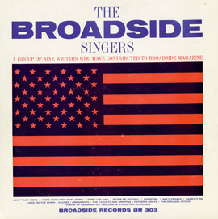

## Plains of old Nebrasky-o

{.left} Program 8 _Broadsides_ in the [Sounds to Grow On](https://folkways.si.edu/sounds-to-grow-on-broadsides-program-8/music/podcast/smithsonian) series contained some wonderful songs, and some terrible ones (Song for Patty, anyone?). Some early Bob Dylan, some early Bob Dylan wannabees, some glorious others. But how could I resist a song that starts 
    
    In school I learned of men who died by the gun
    But not of those who died by the hoe
    The land has drunk the rains
    Of many a farmers blood
    Now forgotten and buried long a go
    

and continues in similar vein?

So, here we are. [The Plains of old Nebrasky-o](Plains-of-old-Nebraskyo.mp3), sung by Eric Chapman with Phil Ochs, from the Folkways album [Broadside Ballads volume 3](https://folkways.si.edu/the-broadside-singers/broadside-ballads-vol-3/american-folk-struggle-protest/music/album/smithsonian). (Bonus tip: for a real chill, listen to Phil Ochs do Links on the Chain.)
